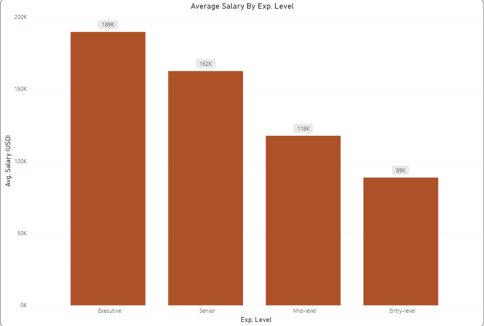
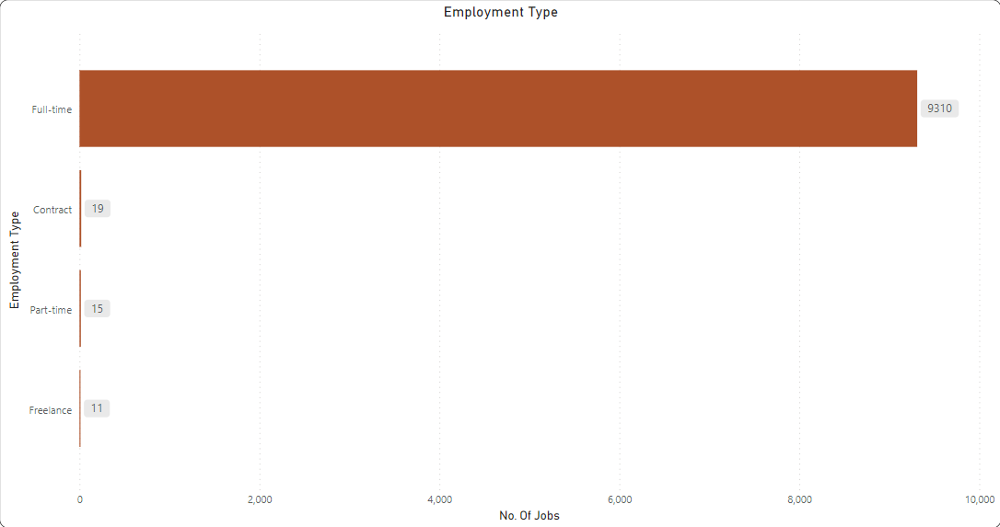
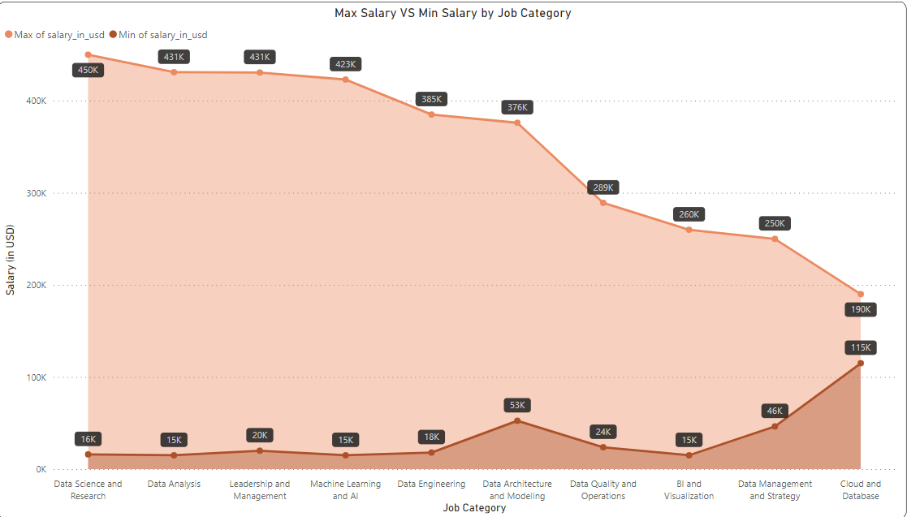
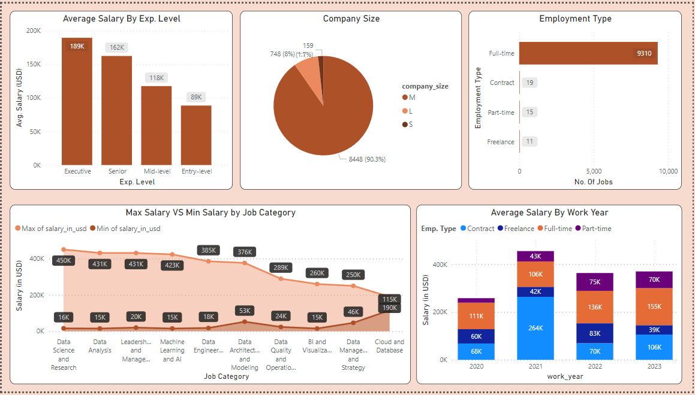

# Jobs in Data Science Visualisation

Explore the dynamic landscape of data science job opportunities with this dataset, sourced from Kaggle. Dive into comprehensive insights about various aspects of data science jobs, including job titles, salaries, and company details.

## Dataset Overview

- **work_year:** 4 unique values
- **job_title:** 125 unique values
- **job_category:** 10 unique values
- **salary_currency:** 11 unique values
- **salary:** 1507 unique values
- **salary_in_usd:** 1786 unique values
- **employee_residence:** 83 unique values
- **experience_level:** 4 unique values
- **employment_type:** 4 unique values
- **work_setting:** 3 unique values
- **company_location:** 70 unique values
- **company_size:** 3 unique values

## Charts Overview

Explore visualizations of the dataset with the following charts:

1. **Average Salary By Experience Level**
   

2. **Employment Type**
   

3. **Maximum Salary vs Minimum Salary By Job Category**
   

4. **Final Dashboard**
   

## Dataset Link

Access the dataset on Kaggle: [Jobs in Data Science Dataset](https://www.kaggle.com/datasets/hummaamqaasim/jobs-in-data)

## Using the Dataset in Power BI

Follow these steps to use the dataset in Power BI:

1. **Clone the Repository:**
   ```bash
   https://github.com/Tomioka-Giyuu/JobsInDataScience-Visualization.git

## Using the Dataset in Power BI

Follow these steps to use the dataset in Power BI:

1. **Open Power BI:**
   ```bash
   Launch Power BI Desktop on your machine.

3. **Import the Dataset:**
   ```bash
   - In Power BI Desktop, go to the "Home" tab.
   - Click on "Get Data" and choose "Text/CSV."
   - Select the `data.csv` file from the cloned repository.

5. **Explore Visualizations:**
   ```bash
   - Once the dataset is loaded, explore the existing visualizations in the Power BI file (`dataset_visualization.pbix`).

7. **Customize and Analyze:**
   ```bash
   - Customize the visualizations or create new ones based on your analysis needs.

9. **Save Changes:**
    ```bash
   - Save any changes made to the Power BI file.
